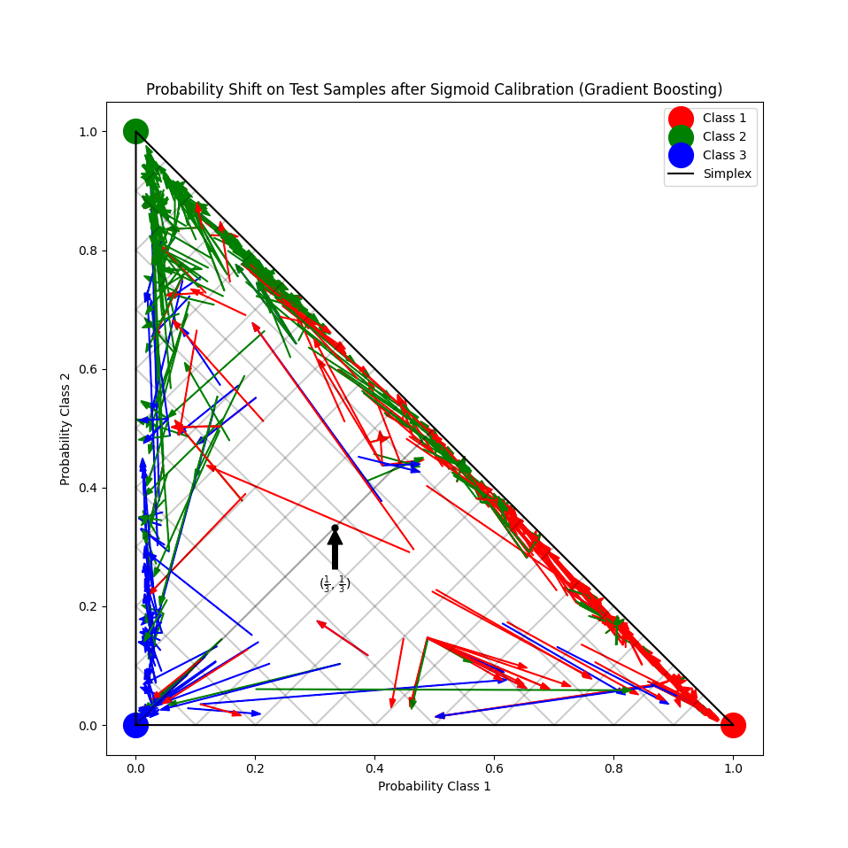
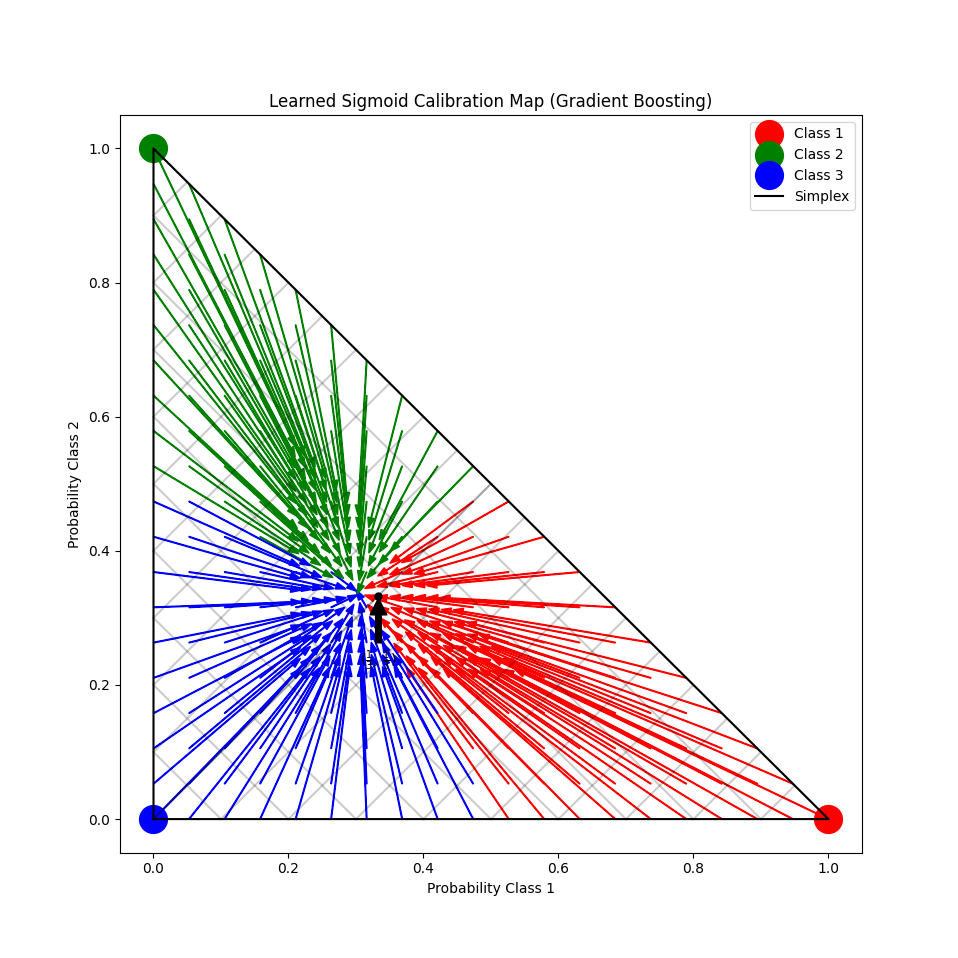

# Probability Calibration for 3-Class Classification (Probability-Calibration-3-CC)
This project is an in-depth demonstration of probability calibration in a multi-class setting using the Sigmoid (Platt Scaling) method. It illustrates how to adjust the output probabilities of an overly confident base estimator, specifically a Gradient Boosting Classifier, to ensure they are statistically reliable.

---

## Project Goal

The primary goal is to transform the raw, often overconfident, probability predictions of a classifier into well-calibrated probabilities. A perfectly calibrated model, when predicting a class with 80% confidence, should be correct approximately 80% of the time.

The project highlights the effectiveness of calibration by comparing key performance metrics and visualizing the transformation in the 2-Simplex space.

---

## Setup and Methodology

The experiment follows a standard methodology to ensure the calibration process is fair and unbiased.
### 1. Data Generation and Splitting

The synthetic classification dataset (`make_blobs`) is split into three distinct subsets for the experiment:

| Dataset | Size | Purpose |
| :--- | :--- | :--- |
| **Train** | 600 samples | Training the base `GradientBoostingClassifier`. |
| **Validation** | 400 samples | Fitting the Sigmoid calibrator (`CalibratedClassifierCV`). |
| **Test** | 1000 samples | Final, unbiased evaluation and visualization. |

### 2. Model Pipeline

Two classifiers are compared:

  - **Uncalibrated Classifier:** A GradientBoostingClassifier trained on the combined Train and Validation sets (first 1000 samples).
    
  - **Calibrated Classifier:** A GradientBoostingClassifier trained on the Train set, then wrapped in CalibratedClassifierCV(method="sigmoid", cv="prefit") and fitted on the Validation set. This two-stage process prevents data leakage.

# Results and Visualization

The core results are visualized using a 2-Simplex, a triangular plot where any point represents a valid probability distribution across the three classes (P1​,P2​,P3​).

### 1. Probability Shift on Test Samples

This plot displays the change in predicted probabilities for each sample in the Test set.

  **Interpretation:** Each arrow starts at the uncalibrated prediction and ends at the calibrated prediction. Arrows generally pointing away from the edges of the simplex and towards the correct class vertex indicate successful calibration, reducing overconfidence.



### 2. Learned Sigmoid Calibration Map

This plot visualizes the transformation function learned by the calibrator across the entire probability space, using a dense grid of synthetic input probabilities.

  - **Interpretation:** This map reveals the transformation behavior. Arrows pointing towards the center show where the model was pulled back from certainty (e.g., a prediction of 95% is pulled down to 80%). It also highlights potential asymmetries or boundaries caused by the One-vs-Rest calibration strategy.



### 3. Metric Comparison

The objective evaluation confirms the visual findings:

| Metric | Uncalibrated (GBoost) | Calibrated (Sigmoid) | Impact of Calibration |
| :--- | :--- | :--- | :--- |
| **Log Loss** | ~1.327 | **~0.549** | Significant Reduction. Log Loss heavily penalizes confident, incorrect predictions. The drop confirms the probabilities are now far more accurate. |
| **Brier Score** | ~0.308 | ~0.310 | Marginal Change. The Brier Score is less sensitive to severe overconfidence 
errors, showing little improvement here. |

---

# How to Run

1.  Clone this repository. 
2.  Install the required libraries: 
    ```bash
    pip install -r requirements.txt
    ```
3. Execute the Python script:
    ```bash
    python probability-calibration.py
    ```

---

- **Contact email:** holandawallacecosta@gmail.com
